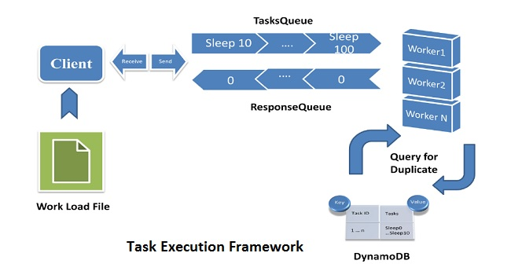

# Cloud-Task-Execution-Framework
Implementation of Task Execution Framework using Amazon's cloud services like SQS and DynamoDB

This document presents with the performance evaluation for: 
<ol>
  <li><strong>Local Back-end Worker</strong></li>
  <li><strong>Remote Back-end Worker</strong></li>
  <li><strong>Animoto Video</strong></li>
</ol>
The diagram below shows the overview of Task Execution Framework for my implementation.  
It consists of a Client, 2 Queues (SQS/ in-memory), Workers (Remote/ Local) and DynamoDB (Remote Workers). 
The Client is presented with a workload file which has tasks (sleep tasks, Image lists file location). The client then puts the jobs onto the SQS tasks queue. 
The worker executes the jobs and writes the response back to response queue. DynamoDB interaction is with worker to check for already executed tasks.  
There is S3 component involved for storing the videos in case of Animoto Clone for converting images to video. 
The instance used for evaluation purpose is t2.micro, linux version: ubutnu and region is us-east-1 (N. Virginia)

</img>
